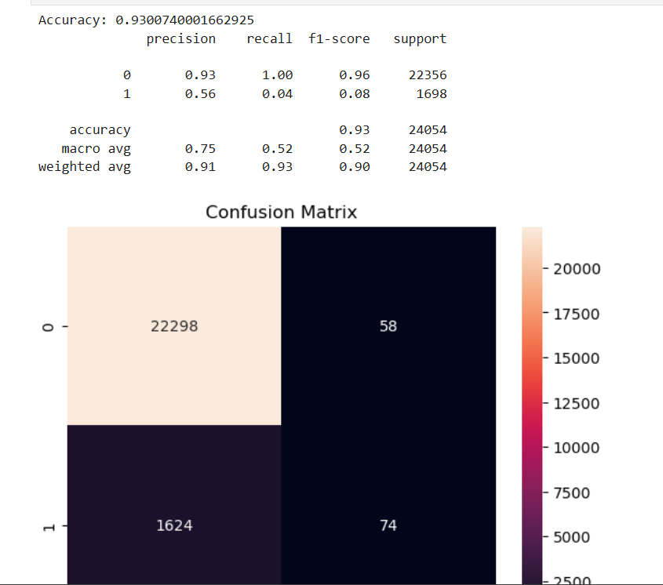

# 🧮 Credit Scoring Model using Machine Learning

This project aims to predict the **creditworthiness of individuals** based on their historical financial data using machine learning classification techniques.

---

## 📌 Problem Statement

> Develop a credit scoring model to predict the creditworthiness of individuals using historical financial data. Utilise classification algorithms and assess the model's accuracy.

---

## 📁 Dataset

- **Source**: [Give Me Some Credit – Kaggle Dataset](https://www.kaggle.com/c/GiveMeSomeCredit)
- **Target Variable**: `SeriousDlqin2yrs` — 1 if person defaulted in next 2 years, else 0
- **Features**: Debt ratio, monthly income, age, credit lines, etc.

---

## 📊 Exploratory Data Analysis

- Checked nulls and cleaned data
- Performed descriptive statistics
- Scaled features using `StandardScaler` to improve model performance

---

## 🤖 Model Used

- **Logistic Regression** (binary classification)
- **Evaluation Metrics**: Accuracy, Precision, Recall, F1-score, Confusion Matrix

---

## 📈 Results

- **Accuracy**: ~93% (example, update with actual score)
- Confusion Matrix:

---

## 🛠️ Tech Stack

- Python
- Jupyter Notebook
- Pandas, NumPy, Scikit-learn, Matplotlib, Seaborn

---

## 🔧 Setup Instructions

bash
# Clone the repo
git clone https://github.com/YOUR_USERNAME/credit-scoring-model.git

# Navigate into the folder
cd credit-scoring-model

# Create virtual environment (optional)
python -m venv venv
source venv/bin/activate  # or venv\Scripts\activate on Windows

# Install dependencies
pip install -r requirements.txt

# Open the notebook
jupyter notebook
